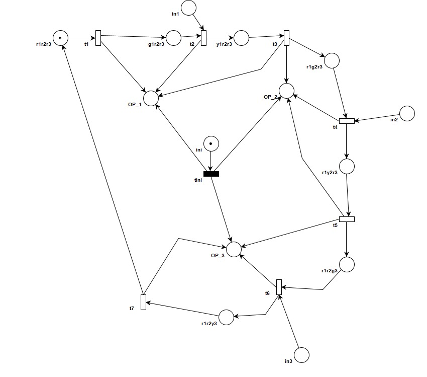
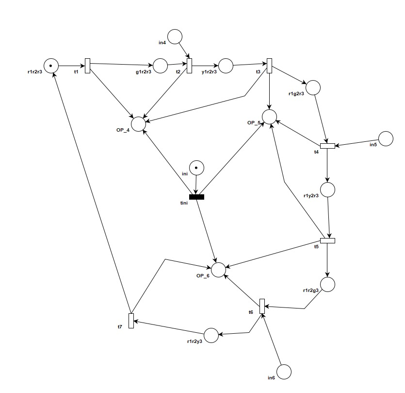
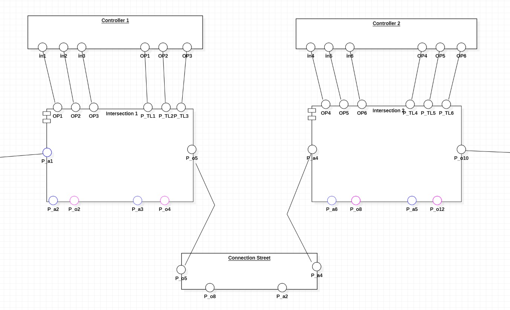

# Distributed Control Systems – Final Project

## Objective

Develop a controller for each intersection (plant) based on the provided map. Each controller should be a closed-loop system with input channels (in1..n) connected to its intersection’s output channels (op1..n) and an Intersections (with the OPs output channels). The controller must feature dynamic delays to extend the green light time during traffic jams. (Project sessions 3, and 5)

## Specifications

1. **Screenshot of the Entire Given Map:**
  
   

2. **Simplified Map Showing Intersections and Connecting Middle Street:**

   

## Design

1. **The OETPN Model for the Plant:**

   

   
2. **The OETPN Model for the Controllers:**

   

   

3. **Place Types, Grd&Map for the Entire OETPN:**

- **Controller 1:**
   - Place Types: 
     - `ini, r1r2r3, g1r2r3, y1r2r3, r1g2r3, r1y2r3, r1r2g3, r1r2y3– Data String`
     - `OP1, OP2, OP3, in1, in2, in3 – Data Transfer`
   - Grd&map: 
     - `iniT : ini!= null => P_a1 != null AND P_x1.CanNotAddCars  => OP1.SendOverNetwork(“ini”) `
                          `   => OP2.SendOverNetwork(“ini”)`
                          `   => OP3.SendOverNetwork(“ini”)`
                          `   => ini.MakeNull(“”)`
     - `t1: r1r2r3.!=null => g1r2r3= r1r2r3 => OP1.SendOverNetwork(“green”)`
     - `t2: g1r2r3 != null AND in1!=null => g1r2r3=y1r2r3`
                             `=> OP1.SendOverNetwork(“yellow”)`
                             `=> t2.DynamicDelay(“Ten”)`

     - `t3: y1r2r3=null  => y1r2r3=r1g2r3`
                             `=> OP1.SendOverNetwork(“red”)`
                             `=> OP2.SendOverNetwork(“green”)`

 - **Controller 2:**
   - Place Types:
     - `Five, Ten– Data Integer;`
     - `ini, r1r2r3, g1r2r3, y1r2r3, r1g2r3, r1y2r3, r1r2g3, r1r2y3– Data String; OP5, OP6, OP7– Data Transfer`
   - Grd&map:
     - `iniT : ini != null => OP5.SendOverNetwork(“ini”)`
     - `t1 : r1r2r3 != null => r1r2r3 = g1r2r3, OP5.SendOverNetwork(“green”)`
     - `t2: g1r2r3.NotNull AND in5.NotNull => OP5.SendOverNetwork(“yellow”), g1r2r3=y1r2r3, t2.DynamicDelay(“Ten”)`

4. **The Component Diagram for the Entire System:**

  

## Implementation

1. **Repository Link:** [GitHub - mayaaaai/DCS-FP](https://github.com/mayaaaai/DCS-FP)

# Testing Procedures

## Car Movement Test

1. **Procedure:**
   - Send a car from the 1st intersection through the middle street, exiting from the 2nd intersection.
   - Attach screenshots demonstrating the car's movement throughout the test.

2. **Logging:**
   - At the conclusion of the test, pause the intersection OETPN.
   - Click on the 'save log' button.

3. **File Saving:**
   - Save the logs as `test1_intersection1.txt` and `test1_intersection2.txt` for separate OETPNs.

4. **Repository Update:**
   - Add the text files to the repository.
     - [Test1 Intersection 1](https://github.com/mayaaaai/DCS-FP/blob/main/test1_Intersection1)
     - [Test1 Intersection 2](https://github.com/mayaaaai/DCS-FP/blob/main/test1_Intersection2)